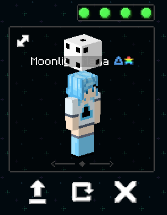
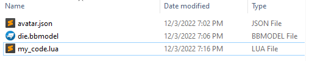

## Step 1: Learning Lua

While making an avatar with a model and some keywords is a great first step, if you want to really take your avatar to the next level you'll need to use a script! Scripting is by far the most powerful part of Figura, but unfortunately it can also be one of the most tricky to get into. If you already know a programming language, you'll have a great head start on this section, but even if you don't, you can learn! That's why you're here, after all.

Figura scripts are made using [Lua](https://www.lua.org/about.html) - a very popular scripting language made specifically for use inside other programs (like Figura). There are many resources out there for learning the fundamentals of Lua - like the previous step for learning Blockbench, an introduction to Lua itself is outside the scope of this guide. If you'd like, you may want to learn Lua yourself before continuing. Doing so would give you a better understanding of the upcoming code, though there will also be explanations of what each block of code is doing in plain English. Seeing examples of code in action is also a great way to get to know a programming language, so read on!

## What Comes Next

The upcoming pages will contain a step-by-step guide for creating a basic yet interesting Lua script for an avatar. Starting with nothing more than a model of a cube above the player's head, we're going to make it spin, allow it to be toggled on and off through the action wheel, change the speed of the rotation, summon particles, and play sounds!

To get started with this, download the avatar below. You'll find that avatars are commonly distributed through `.zip` files. Figura cannot read avatars that are inside `.zip` files directly, so you'll need to use a tool to extract the files to a regular folder instead.

<a href="../TutorialCube.zip" download>Tutorial Cube Avatar</a>

Once you've unzipped the avatar into its own folder, you should be able to select it from the Wardrobe and find a familiar-looking cubic object floating above your head. In order to add code, we're going to need a new file to type the code in. Create a new text file inside the same folder as `avatar.json`, and call it `<ANYTHING YOU WANT>.lua`. Like the model file, the name doesn't matter here either, aside from ensuring it ends with `.lua` so that Figura knows it's a script file.

Once your folder looks something like this (with whatever name you want instead of `my_code`):

You're ready to move on to the next step: [Making the Cube Spin Using Events!](p4_spin.md)
