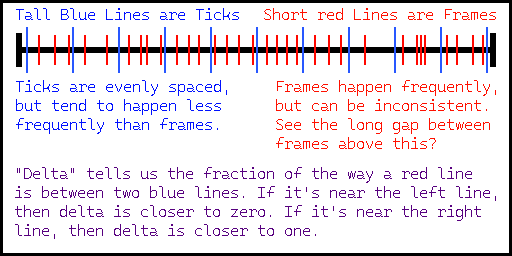

## Rotating the Cube

All of the programming we do here will be inside that `.lua` file you created last time. Open it up with any text editor, and you can start typing code inside. Experienced users tend to prefer programs like Visual Studio Code for editing their avatars, but it can be done with any regular old text editor - even Notepad.

To start, let's get our feet wet by learning how to rotate a cube at all, just once. In order to do that, we're going to need to make use of the `setRot` function that Figura offers for `ModelPart`s. Write the following code in your `.lua` file, save the file, and return to the game.

```lua
models.die.cube:setRot(45, 45, 0)
```
And the cube has rotated! Let's break down this line of code, step by step.

1. We start with the word `models`. This is a special Figura variable that contains all of your `.bbmodel` files in the folder.
2. Then, we use `.die`. Since our file was named `die.bbmodel`, we now have the entire die model. `models.die` is the die model.
3. Next, we use `.cube`. If you open up the file in blockbench, you'll see that in the outliner it contains a part with the name "cube". So now, using `models.die.cube`, we've selected that specific cube.
4. We use `:setRot`. `setRot` is a Figura function that lets us set the rotation of the model part we've selected. Since we selected that cube, using `setRot` here will change the rotation of that cube.
5. We pass `(45, 45, 0)` to `setRot`. `setRot` needs 3 numbers to use: the rotation on the x axis, the y axis, and the z axis. With this code, we rotated that "cube" part by 45 degrees on the x axis, and 45 degrees on the y axis.

## Rotating the Cube Over Time

Now, we're going to make our cube spin at a constant speed. Delete the code from before, and place this code in its place:

```lua
function events.tick()
    local time = world.getTime()
	models.die.cube:setRot(0, time * 5, 0)
end
```
If you load your avatar now, you should see the die slowly spinning around and around! Let's break down this code too, and see what it's doing.

1. The first thing to think about is the idea of the code `function events.tick()`, then some more code, then finally `end`. `events` is another special Figura variable that, when used this way, allows certain code to be run every tick. In Minecraft, a tick occurs 20 times every second. So, by putting the rest of our code inside of this `function events.tick() ...... end`, we make it so that the code inside happens 20 times every second.
2. What did we put inside? The first thing we did was say `local time = world.getTime()`. `world.getTime()` gets the current "time" of the world, which is measured in ticks. Each tick, the world's time goes up by 1. By putting `local time = ` before it, we've taken this number, and stored it inside a variable called `time`.
3. We take our code from before, for setting the rotation of the cube. Except this time, we give it the numbers `(0, time * 5, 0)`. Focus on that second value: `time * 5`. Because `time` refers to the world's time, which is going up by 1 each tick, `time * 5` will be going up by 5 each tick. And since `time * 5` is used as the Y rotation in `setRot`, the cube will rotate by 5 degrees each tick.

## Smoothing Out the Rotation

This is very nice, but there's one problem with the `tick` event: speed. Since `tick` only happens 20 times per second, our cube appears to spin at only 20 FPS, which makes it not look very smooth. In order to fix that, we're going to use a different event, called `render`. While `tick` happens every tick, which is 20 times per second, `render` will happen on every *frame* instead, ensuring that the framerate of the cube's spin is enough for it to always look smooth. Here's the code, again replacing the code we had before:

```lua
function events.render(delta)
    local time = world.getTime() + delta
	models.die.cube:setRot(0, time * 5, 0)
end
```

What's different?

1. We changed `events.tick` to `events.render`, since we want to use the render event instead of the tick event.
2. We added a parameter to our function, and called it delta. The parameter can use any name you want, but many people like to use "delta" for it so that's what we use here.
3. When we calculate our variable `time`, we take the current world time and add `delta` to it.

What is `delta`? To answer that, we need to talk about how Minecraft renders frames. Minecraft performs "ticks" 20 times per second, as we know. But drawing the pictures on the screen happens separately, at a speed that's usually much faster than 20 times per second. As a result, frames will usually be drawn in between ticks. Look at this picture showing a slice of time in a Minecraft game. 



A "render" function will be called on every red line, while a "tick" function will be called on every blue line. The "delta" value is a number from 0 to 1, telling us how far in between the two blue lines *this particular* red line is. Understanding what `delta` is and how it works is a very useful skill for making things change smoothly over time!
